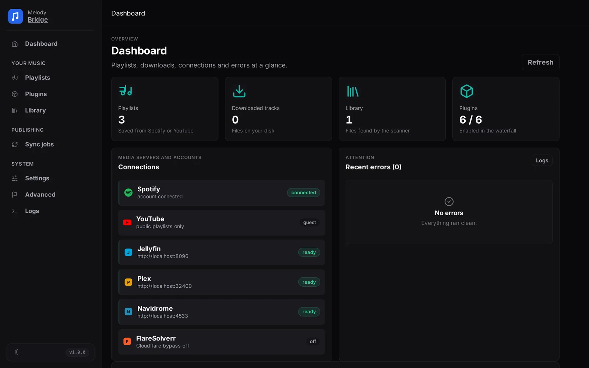

<p align="center"></p>

# MelodyBridge

Self-hosted music toolbox: fetch playlists from Spotify or YouTube, download the tracks through a plugin waterfall, and publish clean M3U or Jellyfin playlists.



## Quick start

You need Docker (or Podman) and nothing else. No clone required:

```bash
mkdir melodybridge && cd melodybridge
wget https://melodybridge.app/compose.yml
docker compose up -d
```

Open http://localhost:3333, add a playlist, press Download.

Podman works the same: `podman compose up -d`.

## Documentation

Full documentation lives at https://docs.melodybridge.app.

## Development

```bash
git clone https://github.com/warreth/melodybridge.git
cd melodybridge
dotnet run --project MelodyBridge.Server
```

Testing and architecture are covered in the [developer guide](docs/developer.md).

## License

AGPL v3, see [LICENSE](LICENSE).