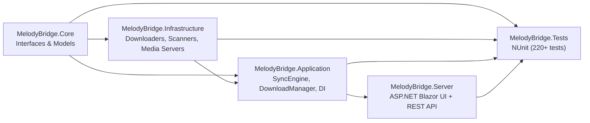

# MelodyBridge Documentation

Welcome to the MelodyBridge documentation. This site covers deployment, usage, plugin development, and the testing guide.

## Sections

### 🐳 [Docker Deployment](docker.md)
Run MelodyBridge as a self-hosted service using Docker or docker-compose. Includes environment variable reference and path remapping notes.

### 🔌 [Developer Guide](developer.md)
Architecture overview, plugin interfaces (`IDownloader`, `ISourceProvider`, `IMediaServerSync`), DI extensions, and the honest-testing guide.

### 🖥️ [Photino Desktop Build](photino.md)
Optional manual build steps for the Photino desktop wrapper around the Blazor UI.

---

## Quick Links

- [README](../README.md) — Project overview and quick start
- [Dockerfile](../Dockerfile) — Multi-stage server image
- [docker-compose.yml](../docker-compose.yml) — Compose with dev defaults
- [MelodyBridge.Tests](../MelodyBridge.Tests/) — NUnit test suite

## Preview Docs Locally

```bash
npm install
npm run docs:dev
# opens http://localhost:5173
```

Requires Node.js 18+. Uses [VitePress](https://vitepress.dev).

## Project Layering


